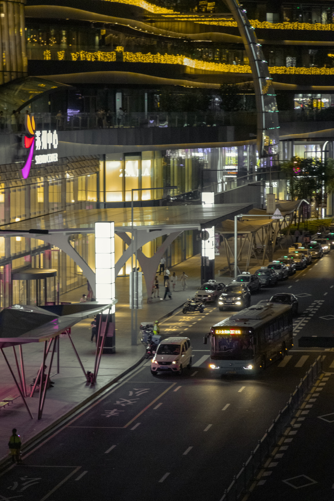
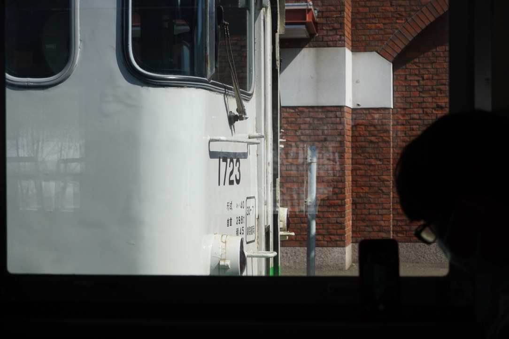

# 2023群台历公告


## 一位不愿透露姓名的征稿群友：

   

```
我是，四年级学生森下下士，是来向你们征稿的。  

我们高年级学生是你们最好的老大鸽！你们有想投稿的照片，可以发给我们，我们会亲切地制作成台历。  

现在请大家做台历照片投稿，每人把自己的照片，摄影时间，摄影的地点等，介绍一下。  

从你那，开始！
```   

## 真真：

    


```  
是！JR东海管内，东海道本线……（被打断）
```

## 众群友：

   


```
没有劲！根本听不见！听不见！再说一遍！重来！这么小声还想开军舰？！
```
## 真真：

    

```
（咆哮） 是！JR东海管内！高山本线沿线！特急！飛騨！
```

## 另一位不愿透露姓名的征稿群友（也许是替身使者）

    

```
好！很有精神！下一个！
```
- - -
## 投稿请参阅：  
 - 投稿邮箱 <a href="mailto:505730682@qq.com"> 505730682@qq.com</a>  
 - 投稿截止日期：**2023/01/15** 
 - 邮件名格式：群台历投稿 + 您的称呼，例：<kbd>群台历投稿 - 助教</kbd>
 - 照片参数要求：照片的长边在<font color = red> **2500像素**  </font> 以上
 - 照片数量要求：每人至多 <font color = red > **6** </font> 张
 - 其他信息要求：请<font color = red> **至少** </font> 告知您的作品的 **摄影时间** 和 **摄影地点** 。 如果您期待作品出现在某个特定的月份，请为照片配解说词，比如说题字或者赋诗等。以便照片应季。   
例：<kbd>春天到了，又到了动物们交配的季节。</kbd>可以作为3/4/5月的投稿作品。

## 本期话事人选稿风格
> - 构图：
> - - 首先，话事人不是很喜欢车辆的大头照或是证件照。
> - - 这家伙更希望交通工具存在于某种“辽阔”气氛感中，并不是记录交通工具本身，而是“某种交通工具”恰好在此时此刻经过了这里。
> - - 但是，话事人也喜欢记录下局部某种细腻的气氛的照片。与“广阔天地中的火车”相反， **“雨夜中巷子那端一闪而过的宁字装光影”** 也能够直击话事人的好球区。
> - 色彩：话事人非常非常喜欢暖色调。
> - 内容：
> - - 不限，从三蹦子到火箭、从猫猫照到月全食，并没有什么特殊的偏好。群友可以从从百草园投稿到三味书屋，乃至门前的枣树。
> - - 但是，如果照片记录了局部的细腻气氛。希望这张照片的描述能够记录下拍摄者，或者说是这段故事中的情绪（光做风光照确实🈚️趣味）。

> **希望上面的电波系描述可以帮助到投稿人。**

> ### 照片例:   
> - 构图例（横版）        
> <kbd></kbd>
> - 构图例（纵版）    
> <kbd></kbd>
> - 构图例（局部）    
> <kbd></kbd>
> - 色彩例    
> <kbd></kbd>

 #  ⇦ To be continued🎵 欢迎大家踊跃投稿。  
ps: 会用Github的群友，可以直接将照片push到Photos文件夹内。

 ## Related Links
- [助教云](http://47.101.158.168)   
- [芳文云](fangwen.cloud)